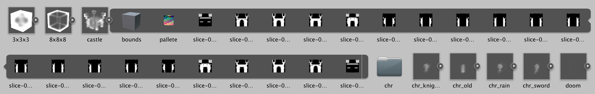

# Vox importer

The vox importer is a importer of native MagicaVoxel format to unity as a set of assets:
1) 1 to N Texture3D assets with volumetric data of chunks
2) Texture2D of pallete
3) (1..N)*Z Texture2D slices of volumetric data

